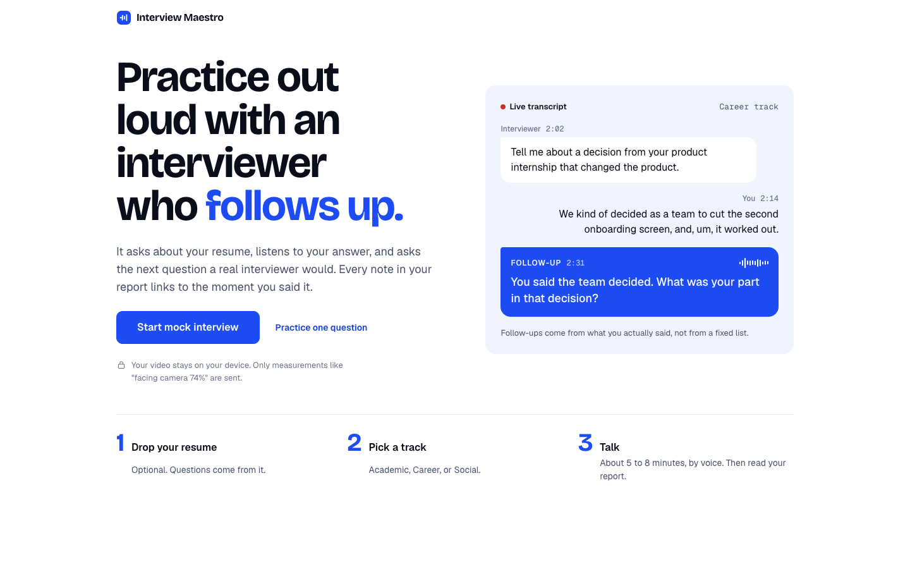
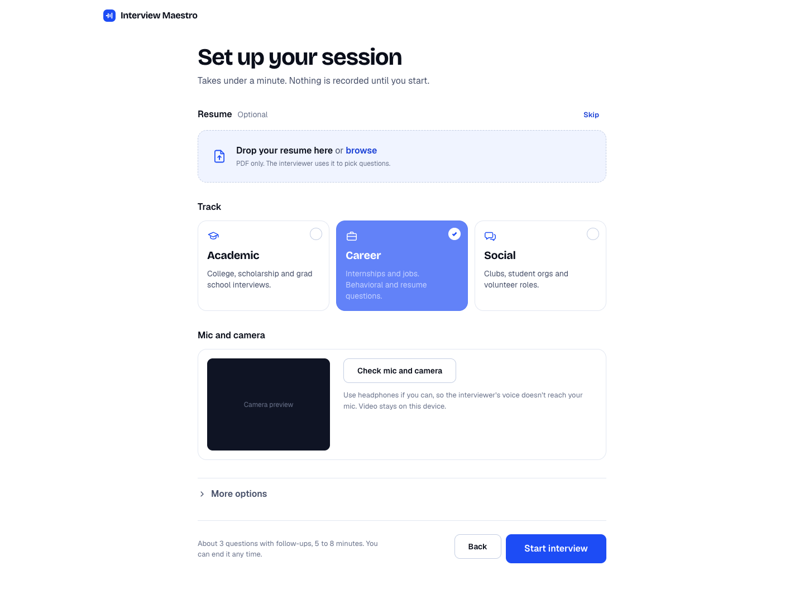
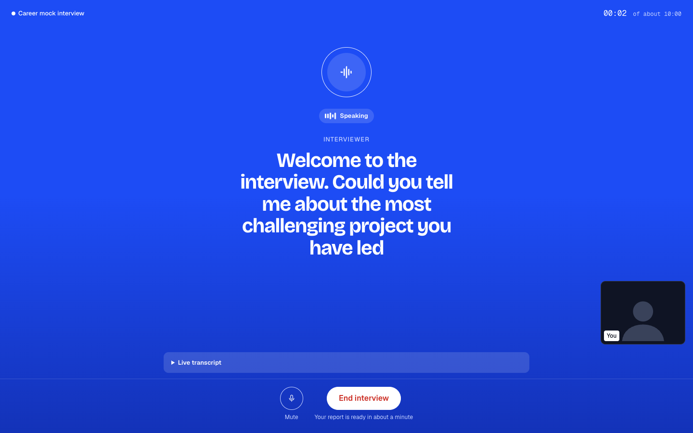
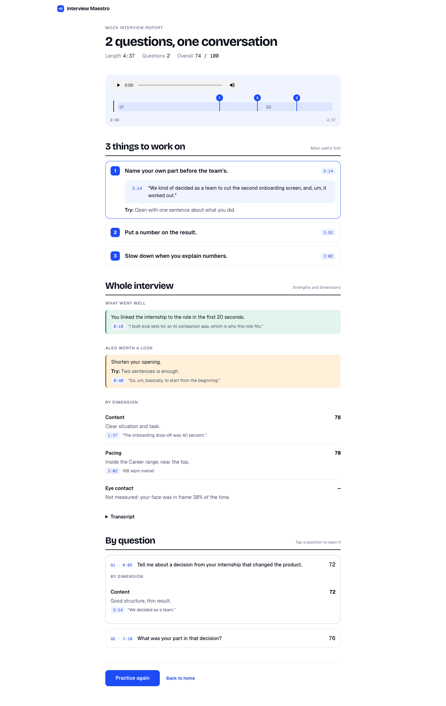

# Interview Maestro

An interview practice tool with a live voice interviewer. It asks about your resume, follows up on what you actually say, and gives a report where every point links to a timestamp and a quote or a measured signal. Scoring uses gemini-2.5-flash (fallbacks: gemini-flash-latest, then gemini-3.5-flash-lite); the interviewer uses gemini-3.8-live (config in pipeline/config.py).




| Setup | Live interview |
| --- | --- |
|  |  |



**How a session goes:** open the landing page, add your resume (optional) and pick a track on one setup screen, then talk with the live interviewer. When you end the call you get a report. Practicing a single question is still available from a link on the landing page.

## Features
- Three tracks: Academic, Career, Social.
- Resume upload accepts PDF only (the backend reads PDFs).
- Evidence-based feedback: every item cites a timestamp plus a transcript quote or a measured signal.
- One main path: Landing, then Setup (resume, track, mic and camera check on one screen), then the live interview, then the report.
- Live interview: a spoken interview with Gemini Live. Questions come from your resume; the interviewer follows up on your answers; you can interrupt it.
- Whole-interview report: an overall score plus feedback for each question.
- Face signals measured in the browser; video never leaves the device.

## What problem this solves

People practicing interviews get vague AI feedback like "be more confident". They cannot check where it came from or what to change. Many tools also guess emotions from the face, which is unreliable.

This tool takes a different approach.

## How it works

**What can be measured is measured in code. Gemini only interprets content.**

Measured in code:
- Speaking pace: words per minute, compared to a per-track band.
- Pauses: ffmpeg silencedetect; pauses of 3 seconds or more are surfaced.
- Filler words: um, uh, you know, "like,", 嗯, 呃, and similar.
- Background noise: signal-to-noise ratio (SNR).
- Eye contact and face-in-frame: measured from the camera.

Interpreted by Gemini: content, structure (STAR), clarity, presence.

**Evidence rule.** Every feedback item must cite a timestamp plus either a verbatim quote from the transcript or a measured signal. Quotes are checked against the transcript in code. Items with fabricated quotes or no evidence are dropped. Clicking a timestamp in the results jumps the recording to that moment.

**No emotion inference.** Words like "nervous" or "not confident" are filtered out in code. Smiling is never counted against the user.

**Noisy audio.** If SNR is below 15 dB, clarity is not scored and pauses are not judged (noise hides silences). Pace is estimated from transcript timestamps instead.

**Camera.** MediaPipe Face Landmarker runs in the browser. Video never leaves the device; only numbers are sent (for example "facing camera 72%", look-away moments). If the face is in frame less than 50% of the time, eye contact and presence are marked "not measured" instead of scored low.

**Score.** A track-weighted average (Academic / Social / Career weights) over the dimensions that could be measured. If less than 80% of the rubric weight was measurable, the UI shows "Partial score" and lists what was not measured.

**Reliability.** 429 quota errors rotate to the next API key; 503 overload switches to a fallback model. SDK retries are capped so the user is not left waiting minutes. Audio is sent inline (no upload round trip) when under 15 MB.

## Live interview

**Why.** Realtime voice alone is now common (general assistants do it well). What this adds: questions grounded in your resume, follow-ups that probe what you just said ("what was YOUR part", "what was the number"), and a report built on measured evidence.

**How.** The backend builds the interviewer's instructions from the resume and context, and mints a one-use ephemeral token (valid 30 min, session must start within 2 min) with the model and instructions locked in. The browser connects to the Live API WebSocket with that token, so the API key never reaches the browser and the instructions cannot be changed client-side. Mic audio is streamed as 16-bit PCM; the interviewer's voice comes back as 24 kHz PCM and is played in the page. Input and output transcription drive live captions. The interviewer is told never to score, praise or comment on feelings during the interview.

**Turn-taking.** The interviewer treats 2.5 s of silence as the end of an answer (LIVE_SILENCE_MS). Longer thinking pauses can still make it start talking; when you continue speaking it stops (barge-in). Raise the value if it cuts people off.

**Report.** Your mic is also recorded in the browser on the same clock as the session. After "End & get report", the recording, the interviewer's turns (with times) and the on-device camera numbers go to /api/session_report. Each answer (from the end of one question to the start of the next) is cut out and transcribed on its own, then scored with the same evidence pipeline. A separate pass produces the overall summary (overall score with coverage, top 2 strengths, top 2 improvements, each with timestamps). Eye contact and presence are shown only in the summary. A question the candidate talked over (interrupted) does not start a new answer.

**Model choice** (one run each, same synthetic answer, via tests/live_smoke.py):

| model | first question | next question after answer ends |
|---|---|---|
| gemini-3.8-live | 0.94 s | 2.86 s |
| gemini-3.1-flash-live-preview | 0.56 s | 4.12 s |
| gemini-2.5-flash-native-audio-latest | 3.75 s | 7.62 s |

gemini-3.8-live was chosen for the fastest follow-up. Across 6 runs of gemini-3.8-live with ephemeral tokens, the opening question arrived 0.9-1.3 s after the session started and the next question 2.9-3.3 s after an answer ended. In 7 headless browser runs, the first caption appeared 2.4-3.5 s after clicking Start (including token and connection), and the session report took 32-64 s (it depends on Gemini load; one run used the fallback model).

**Limits.** Audio-only Live sessions are capped at 15 minutes and a connection at about 10 minutes (no session resumption yet), so keep interviews under 10 minutes. Without headphones the interviewer's voice can leak into the mic; echo cancellation is on and leaked interviewer speech is filtered from the report by timing, but headphones are recommended. Video is never sent to Gemini: it stays on the device (this also keeps the session on the 15-minute audio-only limit instead of 2 minutes for audio+video).

## Testing and evaluation

```bash
./.venv/bin/python tests/test_interpret.py   # offline: evidence, emotion filter, scoring rules
./.venv/bin/python tests/test_metrics.py     # offline: pauses, noise, fillers
./.venv/bin/python tests/test_fallback.py    # offline: key rotation / model fallback
./.venv/bin/python tests/e2e_smoke.py        # real Gemini calls, uses tests/fixtures
node src/signals/aggregate.test.mjs
node src/signals/faceSignals.test.mjs
./.venv/bin/python tests/test_session.py     # offline: splitting a live session into answers
./.venv/bin/python tests/live_smoke.py       # real Live API: token route -> interview -> follow-ups -> session report
node src/live/liveSession.test.mjs
./.venv/bin/python eval/run_eval.py --selftest   # offline
./.venv/bin/python eval/run_eval.py --sample     # real API; see eval/README.md for adding human-rated recordings
```

Current results:
- eval --sample on the two synthetic fixtures: 5/5 rule checks PASS; end-to-end latency 25-31 s per answer.
- A browser-recorded answer replayed against the backend (with camera signals): 33-46 s end to end. The full browser flow (record -> upload -> results page with clickable timestamps) was run headless with a simulated mic/camera.
- Transcription with inline audio: 4-10 s.
- Live interview, headless browser with a simulated mic/camera: interviewer questions grounded in the synthetic resume, follow-ups quoting the answer, voice played in the page, report rendered with clickable timestamps.

## Known limitations

- Gemini transcription sometimes drops filler words despite instructions, so fillers can be undercounted.
- "Eye contact" is head pose (facing the camera), not true eye tracking.
- No human-rated recordings yet, so agreement with human scores (MAE) has not been measured; thresholds and weights in pipeline/config.py are initial assumptions to calibrate.
- The live interview has only been tested with a simulated mic and camera (this build environment cannot open real devices). Test it with a real mic and headphones before a demo.
- Safari may block audio that starts after the network calls; tested in Chrome only.
- Long thinking pauses (over 2.5 s) can make the interviewer start talking; it stops when you continue.
- Feedback takes about 30 s per answer; a whole-interview report took 32-64 s in tests.
- The test fixtures are synthetic (macOS text-to-speech), not real candidates.

## Credits

The original camera/live-interview prototype (public/camera.html) was built by a teammate during the hackathon; the evidence-based pipeline was added in the multimodal-upgrade branch. The live interviewer and whole-interview report were added in the live-interviewer branch.

## 🚀 Getting Started

Follow these steps to set up the project locally.

### Prerequisites
- **Node.js** (v16+)
- **Python** (v3.9+) or **Conda**

### 1. Installation

**Frontend Setup**
```bash
# Install Node dependencies
npm install
```


**Backend Setup**
You can use either Conda or Pip.

*Option A: Conda (Recommended)*
```bash
# Create and activate environment
conda env create -f environment.yml
conda activate Gemini
```

*Option B: Pip*
```bash
# Install requirements
pip install -r requirements.txt
```

### 2. Configuration (Crucial!)

1. Create a `.env` file in the root directory.
2. Add your Google Gemini API key:
   ```env
   GEMINI_API_KEY=YOUR_GEMINI_API_KEY_HERE
   ```
   Optional: provide multiple keys for rotation on quota errors:
   ```env
   GEMINI_API_KEYS=key1,key2,key3
   ```
   *(Note: You can duplicate `.env.example` and rename it to `.env`)*

---

## ▶️ Running the App

One command starts both the backend (:5002) and the frontend (:5173); Ctrl+C stops both:

```bash
npm start
```

Then open http://localhost:5173. If the page says it can't reach the backend, the backend isn't running.

Or run them in two terminals:

**Terminal 1: Start Backend**
```bash
# Make sure your python environment is activated
python backend.py
```
*Backend runs on http://localhost:5002*

**Terminal 2: Start Frontend**
```bash
npm run dev
```
*Frontend runs on http://localhost:5173*

Open **http://localhost:5173** in your browser to begin!

---

## 🌍 Public Deployment (GitHub Pages)

This repo is configured to deploy automatically to GitHub Pages when changes are pushed to the `main` branch. After the workflow completes, the live site will be available at:

**https://fushanbobfan.github.io/Gemini-Hackathon/**

If you fork the repo, update the `base` path in `vite.config.js` and use the corresponding GitHub Pages URL for your account.

### ✅ One-time setup on GitHub
1. Push this branch (`main`) to GitHub.
2. In the GitHub repo, go to **Settings → Pages**.
3. Under **Build and deployment**, set **Source** to **GitHub Actions**.

### 🚀 Deploy (every time you want a new build)
1. Commit and push changes to the `main` branch.
2. Wait for **Actions → Deploy to GitHub Pages** to finish.
3. Open the live URL: **https://fushanbobfan.github.io/Gemini-Hackathon/**

---

## 📂 Project Structure

- **src/**: React frontend source code.
  - `App.jsx`: Switches between screens (landing, setup, live, report, practice) and holds shared inputs.
  - `src/screens/`: `Landing.jsx`, `Setup.jsx`, `QuickPractice.jsx`, with `screens.css` and `session.css`.
  - `src/components/LiveInterview.jsx` and `SessionReport.jsx`: the live call (starts when the screen opens) and the whole-interview report.
  - `src/index.css`: Design tokens (white and cobalt blue) and shared buttons. The design is specified in `docs/product-polish/`.
  - `src/signals/`: Browser-side face measurement (`faceSignals.js`, `aggregate.js`).
  - `src/components/EvidenceFeedback.jsx`: Evidence-based feedback display.
- **pipeline/**: Evaluation pipeline.
  - `config.py`: Model, thresholds, and track weights.
  - `transcribe.py`: Transcription.
  - `audio_metrics.py`: Pauses and noise (SNR).
  - `text_metrics.py`: Pace and filler words.
  - `interpret.py`: Gemini interpretation and evidence checks.
- **tests/**: Offline and smoke tests.
- **eval/**: Evaluation runner and fixtures (`eval/README.md`).
- **backend.py**: Flask server handling AI connectivity.
- **public/camera.html**: Standalone Live Interview module.
- **AudioTesting/** & **CamTest/**: Legacy testing modules.
- **docs/product-polish/**: Product spec, design system, and a clickable design demo for the redesign.
- **docs/screenshots/**: Screenshots used in this README.

## 🛠 Troubleshooting

- **Ports**: Frontend uses `5173`, Backend uses `5002`. Ensure these ports are free.
- **API Key**: If AI feedback fails, check that your `GEMINI_API_KEY` is correct in `.env`.
- **Microphone/Camera**: Allow browser permissions for recording to work.
- **ffmpeg**: Must be installed and on your PATH. Pause detection uses ffmpeg silencedetect.

### Earlier version (May 2026 hackathon build)


